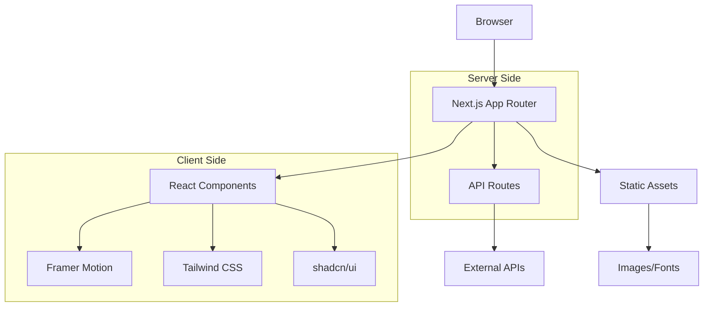

# System Architecture & Design Patterns

## 📐 Architecture Overview

This portfolio website follows modern React architecture principles with a focus on maintainability, performance, and developer experience.

### 🏛️ High-Level Architecture



### 🔄 Data Flow Architecture

```
User Interaction → Component State → Animation Triggers → UI Updates
       ↓                ↓                   ↓             ↓
   Event Handlers → useState/useEffect → Framer Motion → DOM
```

## 🏗️ Project Structure Deep Dive

### App Router Structure
```
app/
├── layout.tsx              # Root layout with global providers
├── page.tsx               # Homepage composition
├── globals.css           # Global styles and CSS variables
├── projects/
│   └── [slug]/
│       └── page.tsx      # Dynamic project pages
├── image-licenses/
│   └── page.tsx         # Legal compliance
└── style-guide/
    └── page.tsx        # Design system showcase
```

**Key Architectural Decisions:**
- **App Router**: Leverages Next.js 13+ App Router for improved performance and developer experience
- **Dynamic Routing**: `[slug]` pattern for scalable project pages
- **Colocation**: Related files grouped by feature rather than type

### Component Architecture
```
components/
├── ui/                    # Atomic design system components
│   ├── button.tsx        # Base button with variants
│   ├── card.tsx         # Container component
│   └── ...              # Other atomic components
├── layout/               # Layout-specific components
│   ├── navigation.tsx   # Top navigation with animations
│   ├── footer.tsx      # Site footer with vertical email
│   └── grid.tsx        # Animated background grid
├── sections/             # Page section components
│   ├── hero.tsx        # Landing hero section
│   ├── about.tsx       # About section
│   ├── experience.tsx  # Career timeline
│   ├── technologies.tsx # Skills showcase
│   └── work.tsx        # Projects grid
└── features/             # Feature-specific components
    ├── chatbot.tsx      # Interactive chatbot
    ├── project-detail-modal.tsx # Project overlays
    └── theme-provider.tsx # Dark mode context
```

## 🎯 Design Patterns

### 1. Composition Pattern
**Implementation**: Component composition over inheritance
```typescript
// Hero component composition
export default function Hero() {
  return (
    <section>
      <HeroContent />
      <HeroAnimation />
      <SocialLinks />
    </section>
  )
}
```

**Benefits**:
- Flexible component reuse
- Clear separation of concerns
- Easy testing and maintenance

### 2. Container-Presenter Pattern
**Implementation**: Separation of logic and presentation
```typescript
// Container (logic)
const ProjectsContainer = () => {
  const [projects, setProjects] = useState([])
  const [filter, setFilter] = useState('')
  
  return <ProjectsGrid projects={filteredProjects} onFilter={setFilter} />
}

// Presenter (UI)
const ProjectsGrid = ({ projects, onFilter }) => {
  return (
    <div className="grid">
      {projects.map(project => <ProjectCard key={project.id} {...project} />)}
    </div>
  )
}
```

### 3. Provider Pattern
**Implementation**: Theme and animation context
```typescript
// Theme Provider
export function ThemeProvider({ children }) {
  const [theme, setTheme] = useState('dark')
  
  return (
    <ThemeContext.Provider value={{ theme, setTheme }}>
      {children}
    </ThemeContext.Provider>
  )
}
```

### 4. Custom Hooks Pattern
**Implementation**: Reusable stateful logic
```typescript
// Custom hook for responsive behavior
export function useResponsive() {
  const [isMobile, setIsMobile] = useState(false)
  
  useEffect(() => {
    const checkSize = () => setIsMobile(window.innerWidth < 768)
    checkSize()
    window.addEventListener('resize', checkSize)
    return () => window.removeEventListener('resize', checkSize)
  }, [])
  
  return { isMobile }
}
```

## 🔄 State Management Strategy

### Local State (useState)
- **Component-specific state**: Form inputs, toggles, temporary UI state
- **Animation state**: Framer Motion controls and triggers
- **UI interactions**: Hover states, modal visibility

### Context State (React Context)
- **Theme state**: Dark/light mode preference
- **Global UI state**: Navigation state, loading indicators
- **User preferences**: Reduced motion, language settings

### Server State (Static)
- **Project data**: Statically defined in components
- **Site configuration**: Build-time constants
- **Static content**: Hardcoded content for performance

## 🎨 Animation Architecture

### Framer Motion Integration
```typescript
// Animation variants pattern
const cardVariants = {
  hidden: { opacity: 0, y: 50 },
  visible: { 
    opacity: 1, 
    y: 0,
    transition: { duration: 0.6, ease: "easeOut" }
  }
}

// Component implementation
<motion.div
  variants={cardVariants}
  initial="hidden"
  whileInView="visible"
  viewport={{ once: true, amount: 0.3 }}
>
  {children}
</motion.div>
```

### Animation Patterns
1. **Entrance Animations**: Elements animate in on scroll
2. **Hover Animations**: Subtle micro-interactions
3. **Page Transitions**: Smooth navigation between routes
4. **Loading Animations**: Skeleton screens and spinners

## 🎯 Performance Architecture

### Code Splitting Strategy
```typescript
// Route-based splitting (automatic)
app/projects/[slug]/page.tsx  // Automatically split

// Component-based splitting (manual)
const HeavyComponent = dynamic(() => import('./HeavyComponent'), {
  loading: () => <Skeleton />,
  ssr: false
})
```

### Image Optimization
```typescript
// Next.js Image component usage
<Image
  src="/project-screenshot.jpg"
  alt="Project Screenshot"
  width={800}
  height={600}
  priority={false}
  placeholder="blur"
  blurDataURL="data:image/jpeg;base64,..."
/>
```

### Bundle Optimization
- **Tree Shaking**: Unused code elimination
- **Dynamic Imports**: Lazy loading of heavy components
- **Font Optimization**: Next.js font optimization
- **Asset Optimization**: Compressed images and icons

## 🔒 Type Safety Architecture

### TypeScript Configuration
```json
{
  "compilerOptions": {
    "strict": true,
    "noUncheckedIndexedAccess": true,
    "exactOptionalPropertyTypes": true
  }
}
```

### Component Type Definitions
```typescript
// Interface-first design
interface ProjectCardProps {
  id: string
  title: string
  description: string
  technologies: string[]
  image: string
  links: {
    live?: string
    github?: string
  }
}

// Generic component patterns
interface MotionWrapperProps<T = HTMLDivElement> {
  children: React.ReactNode
  className?: string
  variants?: Variants
  as?: React.ElementType
}
```

## 🧩 Styling Architecture

### Tailwind CSS Strategy
```css
/* Utility-first approach */
.project-card {
  @apply bg-white dark:bg-gray-800 rounded-lg shadow-lg
         transform transition-transform hover:scale-105
         p-6 space-y-4;
}

/* Component-level customization */
.hero-title {
  @apply text-6xl md:text-8xl font-black tracking-tight
         bg-gradient-to-r from-blue-600 to-purple-600
         bg-clip-text text-transparent;
}
```

### CSS Custom Properties
```css
:root {
  --font-poppins: 'Poppins', sans-serif;
  --font-roboto-mono: 'Roboto Mono', monospace;
  
  /* Animation timing */
  --transition-fast: 0.15s ease;
  --transition-normal: 0.3s ease;
  --transition-slow: 0.6s ease;
  
  /* Spacing scale */
  --space-xs: 0.25rem;
  --space-sm: 0.5rem;
  --space-md: 1rem;
  --space-lg: 2rem;
  --space-xl: 4rem;
}
```

## 🔄 Component Lifecycle Architecture

### Animation Lifecycle
```typescript
const ComponentWithAnimation = () => {
  const [isVisible, setIsVisible] = useState(false)
  
  useEffect(() => {
    // Mount animations
    const timer = setTimeout(() => setIsVisible(true), 100)
    return () => clearTimeout(timer)
  }, [])
  
  return (
    <AnimatePresence>
      {isVisible && (
        <motion.div
          initial={{ opacity: 0 }}
          animate={{ opacity: 1 }}
          exit={{ opacity: 0 }}
        >
          Content
        </motion.div>
      )}
    </AnimatePresence>
  )
}
```

## 🎯 Error Handling Architecture

### Error Boundary Implementation
```typescript
class ErrorBoundary extends React.Component {
  constructor(props) {
    super(props)
    this.state = { hasError: false, error: null }
  }
  
  static getDerivedStateFromError(error) {
    return { hasError: true, error }
  }
  
  componentDidCatch(error, errorInfo) {
    console.error('Error caught by boundary:', error, errorInfo)
    // Send to error tracking service
  }
  
  render() {
    if (this.state.hasError) {
      return <ErrorFallback error={this.state.error} />
    }
    
    return this.props.children
  }
}
```

### Graceful Degradation
- **Animation fallbacks**: Reduced motion preferences
- **Image fallbacks**: Alt text and placeholder images
- **Font fallbacks**: System font stack
- **JavaScript fallbacks**: Server-side rendering

## 🔧 Build Architecture

### Next.js Configuration
```javascript
// next.config.mjs
const nextConfig = {
  // Performance optimizations
  experimental: {
    optimizeCss: true,
    gzipSize: true
  },
  
  // Image optimization
  images: {
    domains: ['images.unsplash.com'],
    formats: ['image/webp', 'image/avif']
  },
  
  // Bundle analyzer
  webpack: (config, { dev, isServer }) => {
    if (!dev && !isServer) {
      config.resolve.alias = {
        ...config.resolve.alias,
        '@': path.resolve(__dirname)
      }
    }
    return config
  }
}
```

## 📈 Scalability Considerations

### Component Scalability
- **Atomic Design**: Scalable component hierarchy
- **Prop Interfaces**: Consistent API design
- **Composition**: Flexible component combinations

### Performance Scalability
- **Virtual Scrolling**: For large lists (future implementation)
- **Memoization**: React.memo and useMemo for expensive operations
- **Lazy Loading**: Progressive content loading

### Maintenance Scalability
- **TypeScript**: Compile-time error catching
- **ESLint Rules**: Consistent code style enforcement
- **Documentation**: Comprehensive inline documentation

This architecture provides a solid foundation for a maintainable, performant, and scalable portfolio website while demonstrating modern React and Next.js best practices.